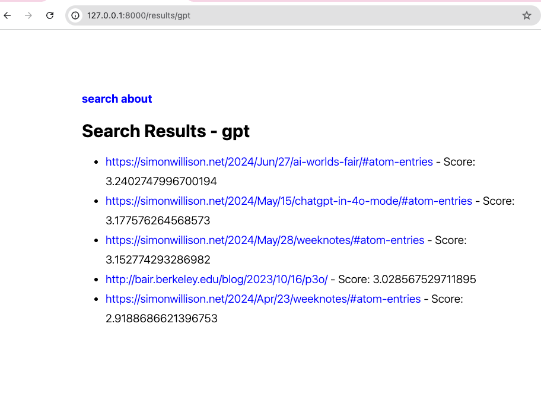

# Search Engine in Python

A tiny search engine in python following the guide
[https://www.alexmolas.com/2024/02/05/a-search-engine-in-80-lines.html](https://www.alexmolas.com/2024/02/05/a-search-engine-in-80-lines.html)


# Provide an index of links to crawl.


```bash
cat > feeds.txt <<EOF
http://bair.berkeley.edu/blog/feed.xml
http://benanne.github.io/feed.xml
https://simonwillison.net/atom/entries/
https://blog.bytebytego.com/feed
https://eli.thegreenplace.net/feeds/all.atom.xml
EOF
```

# Crawl the feeds.txt

```bash
python crawler.py --feed-path feeds.txt
```

This will create a file output.parquet, which is the [parquet format](https://arrow.apache.org/docs/python/parquet.html)


# Search the index

```bash
python main.py --data-path output.parquet
```

```
INFO:     Started server process [27449]
INFO:     Waiting for application startup.
INFO:     Application startup complete.
INFO:     Uvicorn running on http://127.0.0.1:8000 (Press CTRL+C to quit)
INFO:     127.0.0.1:51026 - "GET / HTTP/1.1" 200 OK
INFO:     127.0.0.1:51041 - "GET /results/gpt HTTP/1.1" 200 OK
```


# Screenshots



